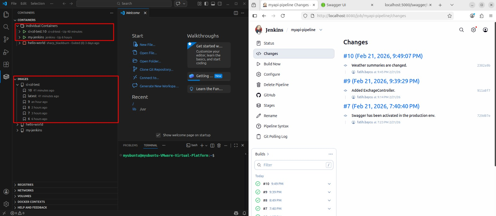

# 🚀 CI/CD Jenkins Learning Project – .NET 8 Web API + Jenkins + Docker

This project is built to understand and practice CI/CD Jenkins fundamentals by creating a complete end-to-end pipeline. The goal is not to build a production-grade system, but to clearly understand the core philosophy of DevOps automation.

## 🧠 Project Purpose
This repository demonstrates a minimal CI/CD workflow:
**Code Commit → Jenkins Pipeline → Docker Build → Container Deploy**

The deployment process is automatically triggered when changes are pushed to the `deploy` branch.

## 🏗️ Technologies Used
* **.NET 8 Web API**
* **Docker** (Multi-stage build)
* **Jenkins** (Running inside Docker)
* **GitHub** (SCM & branch trigger)

## 📁 Project Structure
```text
CI_CD_Test
│
├── CI_CD_Test.sln
├── Dockerfile
├── Jenkinsfile
│
└── CI_CD_Test.WebAPI
    ├── Controllers
    ├── Program.cs
    └── ...

```

---

## 🐳 Docker Configuration

The application uses a **multi-stage Docker build** to keep the runtime image small and separate the build environment from production.

### Dockerfile Overview

1. **Build Stage:** Uses `mcr.microsoft.com/dotnet/sdk:8.0`, restores dependencies, and publishes the project.
2. **Runtime Stage:** Uses `mcr.microsoft.com/dotnet/aspnet:8.0`, copies the published output, and runs the application.

---

## ⚙️ Jenkins Setup (Running Inside Docker)

Jenkins is executed as a Docker container. To allow Jenkins to build and run Docker containers, it must access the host Docker daemon.

### 🔹 The Solution: Custom Jenkins Image

By default, Jenkins containers lack Docker CLI and permissions. We use a custom Dockerfile for Jenkins:

```dockerfile
FROM jenkins/jenkins:lts
USER root
RUN apt-get update && apt-get install -y docker.io
RUN groupadd -f docker
RUN usermod -aG docker jenkins
USER jenkins

```

### 🔹 Running the Container

```bash
docker run -d \
  --name jenkins \
  -p 8080:8080 \
  -v /var/run/docker.sock:/var/run/docker.sock \
  -v jenkins_home:/var/jenkins_home \
  jenkins-custom

```

> **Note:** Mounting `/var/run/docker.sock` allows the Jenkins container to communicate with the host's Docker engine.

---

## 🔄 CI/CD Pipeline

The pipeline is defined in the `Jenkinsfile` and is triggered on the `deploy` branch.

### Jenkins Pipeline (Jenkinsfile)

```groovy
pipeline {
    agent any

    environment {
        IMAGE_NAME = "ci-cd-test"
    }

    stages {
        stage('Docker Build') {
            steps {
                sh "docker build -t ${IMAGE_NAME}:${BUILD_NUMBER} ."
                sh "docker tag ${IMAGE_NAME}:${BUILD_NUMBER} ${IMAGE_NAME}:latest"
            }
        }

        stage('Deploy Container') {
            steps {
                sh """
                docker stop ${IMAGE_NAME} || true
                docker rm ${IMAGE_NAME} || true
                docker run -d -p 5000:8080 --name ${IMAGE_NAME} ${IMAGE_NAME}:${BUILD_NUMBER}
                """
            }
        }
    }
}

```

---

## 🔁 Trigger Configuration

* **Option 1 – SCM Polling:** `H/1 * * * *` (Jenkins checks GitHub every minute).
* **Option 2 – GitHub Webhook (Recommended):** Triggers build immediately on push (requires static IP or tunnel).

## 🌍 Deployment Result
The container is accessible at: 
```bash
http://<server-ip>:5000
```
Port mapping:
```bash
Host: 5000
Container:8080
```
---

## 📌 Key DevOps Concepts Practiced

* **Jenkins Agent:** Execution environment management.
* **BUILD_NUMBER:** Auto-incremented versioning for Docker tags.
* **Idempotent Deployment:** Using `stop || true` and `rm || true` for safe redeploys.
* **Docker Socket Mapping:** Controlling host Docker from within a container.

**🎯 Final Note:** Commit → Build → Image → Container → Live. This is the heart of automation.
---

.