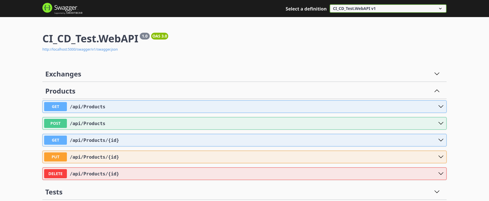

# 🚀 CI/CD Jenkins Learning Project – .NET 8 Web API + Jenkins + Docker

This project is built to understand and practice CI/CD Jenkins fundamentals by creating a complete end-to-end pipeline. The goal is not to build a production-grade system, but to clearly understand the core philosophy of DevOps automation.

## 🧠 Project Purpose
This repository demonstrates a minimal CI/CD workflow:
**Code Commit → Jenkins Pipeline → Docker Build → Container Deploy**

The deployment process is automatically triggered when changes are pushed to the `deploy` branch.

## 🏗️ Technologies Used
* **.NET 8 Web API**
* **Layered Architecture** (Domain, Infrastructure, WebAPI, Tests)
* **Entity Framework Core 8** (Code‑First)
* **PostgreSQL**
* **Docker** (Multi-stage build)
* **Jenkins** (Running inside Docker)
* **GitHub** (SCM & branch trigger)
* **xUnit** (automated tests)

## 📁 Project Structure
```text
CI_CD_Test
│
├── CI_CD_Test.sln
├── Dockerfile
├── Jenkinsfile
│
├── CI_CD_Test.Domain
│   └── Entities
│       └── Product.cs
│
├── CI_CD_Test.Infrastructure
│   ├── Data
│   │   └── AppDbContext.cs
│   ├── Interfaces
│   │   └── IProductRepository.cs
│   └── Postgres
│       └── ProductRepository.cs
│
├── CI_CD_Test.WebAPI
│   ├── Controllers
│   │   ├── ProductsController.cs   (Product CRUD)
│   │   └── ExchangesController.cs  (TCMB XML example)
│   ├── Program.cs                  (DI, EF Core, PostgreSQL config)
│   └── appsettings*.json           (connection strings)
│
└── CI_CD_Test.Tests
    ├── Controllers
    │   └── ExchangesControllerTests.cs
    └── Repositories
        └── ProductRepositoryTests.cs
```

---

## 🐳 Docker Configuration

The application uses a **multi-stage Docker build** to keep the runtime image small and separate the build environment from production.

### Dockerfile Overview

1. **Build Stage:** Uses `mcr.microsoft.com/dotnet/sdk:8.0`, restores dependencies, and publishes the project.
2. **Runtime Stage:** Uses `mcr.microsoft.com/dotnet/aspnet:8.0`, copies the published output, and runs the application.

---

## ⚙️ Jenkins Setup (Running Inside Docker)

Jenkins is executed as a Docker container. To allow Jenkins to build and run Docker containers, it must access the host Docker daemon.

### 🔹 Shared Docker Network (`public-network`)

Both Jenkins and the PostgreSQL database run on a shared Docker network called `public-network`.  
Create it once on the host:

```bash
docker network create public-network
```

### 🔹 PostgreSQL with Docker Compose

PostgreSQL is started with `docker-compose` using the same `public-network`:

```yaml
version: '3.8'

services:
  global-db:
    image: postgres:15-alpine
    container_name: global-db
    restart: always
    environment:
      - POSTGRES_USER=fatih_admin
      - POSTGRES_PASSWORD=fatih_pass123
      - POSTGRES_DB=master_db
    ports:
      - "5432:5432"
    networks:
      - public-network
    volumes:
      - postgres_data:/var/lib/postgresql/data

networks:
  public-network:
    external: true # This network is created manually on the host

volumes:
  postgres_data:
```

### 🔹 The Solution: Custom Jenkins Image

By default, Jenkins containers lack Docker CLI and permissions. We use a custom Dockerfile for Jenkins:

```dockerfile
FROM jenkins/jenkins:lts
USER root
RUN apt-get update && apt-get install -y docker.io
RUN groupadd -f docker
RUN usermod -aG docker jenkins
USER jenkins

```

### 🔹 Running the Jenkins Container (on `public-network`)

```bash
docker run -d \
  --name jenkins \
  --network public-network \
  -p 8080:8080 \
  -v /var/run/docker.sock:/var/run/docker.sock \
  -v jenkins_home:/var/jenkins_home \
  my-jenkins
```

> **Note:** Mounting `/var/run/docker.sock` allows the Jenkins container to communicate with the host's Docker engine.

---

## 🔄 CI/CD Pipeline

The pipeline is defined in the `Jenkinsfile` and is triggered on the `deploy` branch.

### Jenkins Pipeline (Jenkinsfile)

```groovy
pipeline {
    agent any

    environment {
        IMAGE_NAME = "ci-cd-test"
        CONTAINER_NAME = "ci-cd-test"
        NETWORK_NAME = "public-network"
    }

    stages {

        // =========================
        // 1️⃣ TEST STAGE
        // =========================
        stage('Test') {
            agent {
                docker {
                    image 'mcr.microsoft.com/dotnet/sdk:8.0'
                    args '-u root'
                }
            }
            steps {
                echo 'Running unit tests inside Docker SDK container...'
                sh 'dotnet restore'
                sh 'dotnet test --no-restore'
            }
        }

        // =========================
        // 2️⃣ DOCKER BUILD
        // =========================
        stage('Docker Build') {
            steps {
                echo 'Building Docker image...'
                sh "docker build -t ${IMAGE_NAME}:${BUILD_NUMBER} ."
                sh "docker tag ${IMAGE_NAME}:${BUILD_NUMBER} ${IMAGE_NAME}:latest"
            }
        }

        // =========================
        // 3️⃣ DEPLOY
        // =========================
        stage('Deploy Container') {
            steps {
                echo 'Stopping old container (if exists)...'
                sh "docker stop ${CONTAINER_NAME} || true"
                sh "docker rm ${CONTAINER_NAME} || true"

                echo 'Running new container...'
                sh """
                docker run -d \
                    -p 5000:8080 \
                    --name ${CONTAINER_NAME} \
                    --network ${NETWORK_NAME} \
                    -e ConnectionStrings__PostgreSQL="Host=global-db;Port=5432;Database=ci_cd_test_db;Username=fatih_admin;Password=fatih_pass123" \
                    ${IMAGE_NAME}:${BUILD_NUMBER}
                """
            }
        }
    }

    post {
        success {
            echo "✅ Deployment successful - Build #${BUILD_NUMBER}"
        }
        failure {
            echo "❌ Pipeline failed - Check logs"
        }
    }
}
```

### What the Pipeline Does

1. **Test:** Runs all xUnit tests (`CI_CD_Test.Tests`) inside a temporary `.NET 8 SDK` container.
2. **Docker Build:** Builds and tags the application image (`ci-cd-test`).
3. **Deploy Container:** Stops/removes any existing container and runs the new version on port `5000 → 8080`, passing the PostgreSQL connection string via environment variable.

---

## 🔁 Trigger Configuration

* **Option 1 – SCM Polling:** `H/1 * * * *` (Jenkins checks GitHub every minute).
* **Option 2 – GitHub Webhook (Recommended):** Triggers build immediately on push (requires static IP or tunnel).

## 🌍 Deployment Result
The container is accessible at: 
```bash
http://<server-ip>:5000
```
Port mapping:
```bash
Host: 5000
Container:8080
```
---

## 📌 Key DevOps Concepts Practiced

* **Jenkins Agent:** Execution environment management.
* **BUILD_NUMBER:** Auto-incremented versioning for Docker tags.
* **Idempotent Deployment:** Using `stop || true` and `rm || true` for safe redeploys.
* **Docker Socket Mapping:** Controlling host Docker from within a container.

**🎯 Final Note:** Commit → Build → Image → Container → Live. This is the heart of automation.
---

Jenkins and Docker Screenshot            |  "API, Swagger Screenshot
:-------------------------:|:-------------------------:
  |  